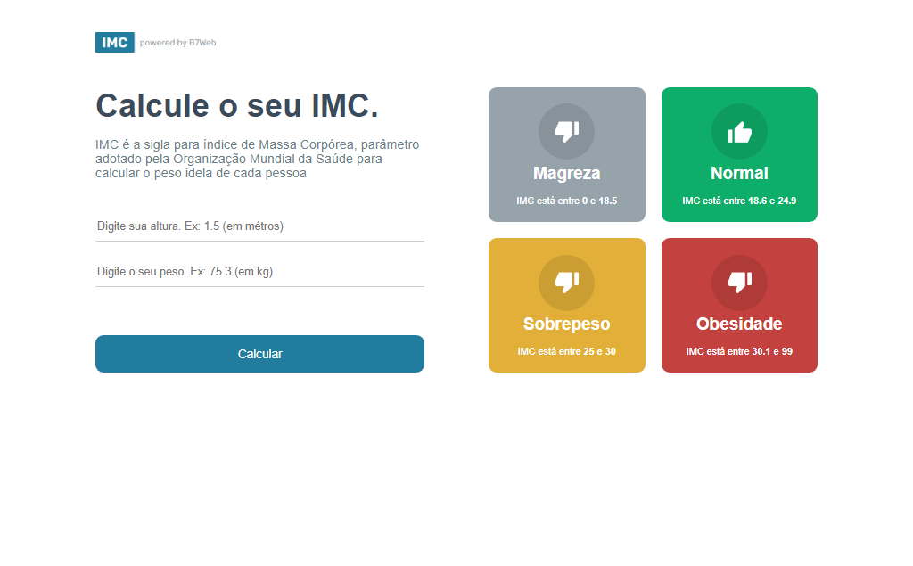

# Calculadora de IMC

> Calculadora

Calculadora de IMC é o meu primeiro projeto em ReactJS + Typescript.

[Clique para acessar](https://guimiiller.github.io/calc-imc/)

## 🚀 Tecnologias

- ReactJS
- Typescript
- CSS
- Git e Github

## 💻 O que aprendi

- Aprendi como usar o useState
- Aprendi mais sobre Typescript
- Como usar um componente

## 📨 Contato

- guilhermemillerblack@gmail.com